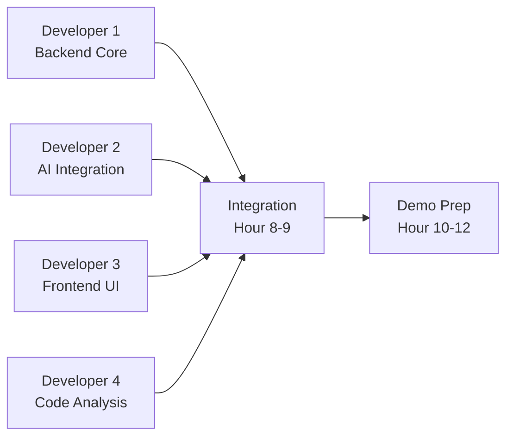

# 12-Hour Hackathon Plan: Code Understanding & Onboarding Accelerator PoC

**Team Size:** 4 Developers  
**Duration:** 12 Hours  
**Goal:** Working demo showcasing code analysis, AI-powered explanations, and basic onboarding features

---

## 🎯 High-Level Overview

### What We'll Build in 12 Hours

A functional PoC that demonstrates:
1. **Code Upload & Analysis** - Upload a Python repository and analyze its structure
2. **AI-Powered Explanations** - Use watsonx.ai to explain code components
3. **Visual Dashboard** - Display code metrics, dependencies, and insights
4. **Basic Onboarding** - Generate simple onboarding documentation

### What We'll Skip (Post-Hackathon)
- Full authentication system (use mock/basic auth)
- watsonx Orchestrate integration (focus on watsonx.ai only)
- Advanced visualizations (use simple charts)
- Comprehensive testing (focus on core happy path)
- Production deployment (local demo only)

---

## 📊 MVP Scope Definition

### MUST HAVE (Core Demo Features)
✅ Upload a Python repository (GitHub URL or ZIP)  
✅ Parse Python files and extract functions/classes  
✅ Calculate basic code metrics (LOC, complexity)  
✅ Send code snippets to watsonx.ai for explanation  
✅ Display code with syntax highlighting  
✅ Show AI-generated explanations  
✅ Simple dashboard with metrics  
✅ Generate basic onboarding document  

### NICE TO HAVE (If Time Permits)
⭐ Dependency graph visualization  
⭐ Search functionality  
⭐ Multiple file comparison  
⭐ Export onboarding materials  

### OUT OF SCOPE
❌ User authentication/authorization  
❌ Database persistence (use in-memory/file storage)  
❌ watsonx Orchestrate workflows  
❌ Advanced security features  
❌ Production deployment  

---

## 👥 Team Structure & Parallel Work Streams



### Developer Roles

| Developer | Primary Focus | Secondary Support |
|-----------|--------------|-------------------|
| **Dev 1** | Backend API, FastAPI setup, endpoints | Help with deployment |
| **Dev 2** | watsonx.ai integration, AI prompts | Help with backend |
| **Dev 3** | React frontend, Carbon UI, code viewer | Help with styling |
| **Dev 4** | Code parsing, analysis engine, metrics | Help with integration |

---

## ⏰ Timeline Overview (12 Hours)

| Time Block | Phase | Focus | Checkpoint |
|------------|-------|-------|------------|
| **Hour 0-1** | Setup | Environment, dependencies, project structure | All devs have working local setup |
| **Hour 1-3** | Core Build | Parallel development of core components | Basic components working independently |
| **Hour 3-5** | Feature Dev | Build main features in parallel | Features testable in isolation |
| **Hour 5-7** | Integration Prep | API contracts, data formats, mock data | Ready for integration |
| **Hour 7-9** | Integration | Connect frontend-backend-AI | End-to-end flow working |
| **Hour 9-10** | Polish | Bug fixes, UI improvements, error handling | Stable demo |
| **Hour 10-11** | Demo Prep | Test demo flow, prepare sample repo, slides | Demo rehearsed |
| **Hour 11-12** | Buffer | Final fixes, backup plan, documentation | Ready to present |

---

## 🔧 Detailed Task Breakdown by Developer

---

## 👨‍💻 DEVELOPER 1: Backend Core + API

**Primary Goal:** Create FastAPI backend with essential endpoints

### Hour 0-1: Setup & Structure
- [ ] Initialize FastAPI project structure
- [ ] Set up virtual environment and install dependencies
- [ ] Create basic project structure:
  ```
  backend/
  ├── app/
  │   ├── main.py
  │   ├── api/
  │   │   ├── routes/
  │   │   │   ├── projects.py
  │   │   │   ├── analysis.py
  │   │   │   └── ai.py
  │   ├── models/
  │   ├── services/
  │   └── utils/
  ├── requirements.txt
  └── .env
  ```
- [ ] Configure CORS for frontend communication
- [ ] Test basic "Hello World" endpoint

**Dependencies to install:**
```bash
pip install fastapi uvicorn python-multipart pydantic requests python-dotenv
```

### Hour 1-3: Core API Endpoints
- [ ] **POST /api/upload** - Accept GitHub URL or file upload
  - Save to temp directory
  - Return project_id
- [ ] **GET /api/projects/{id}** - Get project metadata
- [ ] **POST /api/analyze/{id}** - Trigger analysis (calls Dev 4's service)
- [ ] **GET /api/analysis/{id}** - Get analysis results
- [ ] Create Pydantic models for request/response validation
- [ ] Add basic error handling

**Key Models:**
```python
class ProjectCreate(BaseModel):
    github_url: Optional[str]
    name: str

class AnalysisResult(BaseModel):
    project_id: str
    total_files: int
    total_lines: int
    functions: List[dict]
    classes: List[dict]
```

### Hour 3-5: AI Integration Endpoints
- [ ] **POST /api/explain** - Send code to watsonx.ai (calls Dev 2's service)
  - Accept code snippet + context
  - Return AI explanation
- [ ] **POST /api/onboarding/generate** - Generate onboarding doc
- [ ] Add request queuing for AI calls (simple in-memory queue)
- [ ] Implement basic rate limiting

### Hour 5-7: Integration Prep
- [ ] Create mock responses for all endpoints
- [ ] Document API with FastAPI auto-docs
- [ ] Test all endpoints with Postman/curl
- [ ] Create integration helpers for Dev 2 & 4 services
- [ ] Set up simple file-based storage (JSON files)

### Hour 7-9: Integration & Testing
- [ ] Integrate with Dev 4's analysis service
- [ ] Integrate with Dev 2's AI service
- [ ] Test end-to-end flow: upload → analyze → explain
- [ ] Fix integration bugs
- [ ] Add logging for debugging

### Hour 9-12: Polish & Support
- [ ] Improve error messages
- [ ] Add request validation
- [ ] Help with deployment/demo setup
- [ ] Create API documentation
- [ ] Prepare sample API calls for demo

**Critical Success Factors:**
- ✅ All endpoints return valid responses by Hour 5
- ✅ Integration with other services working by Hour 8
- ✅ No crashes during demo flow

---

## 🤖 DEVELOPER 2: AI Integration + watsonx.ai

**Primary Goal:** Integrate watsonx.ai for code explanations and onboarding generation

### Hour 0-1: Setup & Credentials
- [ ] Get watsonx.ai API credentials (API key, project ID)
- [ ] Install IBM watsonx.ai SDK
- [ ] Create AI service module structure:
  ```
  backend/app/services/
  ├── ai_service.py
  ├── prompts.py
  └── watsonx_client.py
  ```
- [ ] Test basic connection to watsonx.ai
- [ ] Verify Granite model access

**Dependencies:**
```bash
pip install ibm-watsonx-ai ibm-cloud-sdk-core
```

**Test Connection:**
```python
from ibm_watsonx_ai.foundation_models import Model

model = Model(
    model_id="ibm/granite-13b-chat-v2",
    credentials={"apikey": "YOUR_KEY"},
    project_id="YOUR_PROJECT_ID"
)
response = model.generate_text("Hello, test")
print(response)
```

### Hour 1-3: Code Explanation Service
- [ ] Create `explain_code()` function
  - Input: code snippet, language, context
  - Output: natural language explanation
- [ ] Design effective prompts for code explanation
- [ ] Implement prompt templates:
  ```python
  EXPLAIN_FUNCTION_PROMPT = """
  Explain this Python function in simple terms:
  
  Function name: {name}
  Code:
  {code}
  
  Provide:
  1. What it does
  2. Input parameters
  3. Return value
  4. Key logic
  """
  ```
- [ ] Test with sample Python functions
- [ ] Handle API errors and timeouts

### Hour 3-5: Advanced AI Features
- [ ] Create `summarize_module()` function
  - Input: entire Python file
  - Output: high-level summary
- [ ] Create `identify_patterns()` function
  - Input: code snippet
  - Output: design patterns, best practices
- [ ] Implement caching for repeated queries (simple dict cache)
- [ ] Optimize token usage (truncate long code, focus on key parts)

**Prompt Examples:**
```python
SUMMARIZE_MODULE_PROMPT = """
Analyze this Python module and provide:
1. Main purpose
2. Key classes and functions
3. Dependencies
4. Usage example

Module: {filename}
Code:
{code}
"""

ONBOARDING_PROMPT = """
Create a beginner-friendly onboarding guide for this codebase:

Project: {project_name}
Key modules: {modules}
Main functionality: {description}

Generate:
1. Project overview
2. Getting started steps
3. Key concepts to understand
4. Recommended learning path
"""
```

### Hour 5-7: Onboarding Generation
- [ ] Create `generate_onboarding()` function
  - Input: project analysis results
  - Output: structured onboarding document
- [ ] Design onboarding document template
- [ ] Test with sample project data
- [ ] Format output as Markdown

### Hour 7-9: Integration & Optimization
- [ ] Integrate with Dev 1's API endpoints
- [ ] Test AI responses with real code samples
- [ ] Optimize prompt engineering for better results
- [ ] Add retry logic for failed API calls
- [ ] Implement response streaming (if time permits)

### Hour 9-12: Polish & Demo Prep
- [ ] Fine-tune prompts for demo quality
- [ ] Prepare impressive demo examples
- [ ] Add fallback responses for API failures
- [ ] Document AI service usage
- [ ] Create sample AI responses for backup

**Critical Success Factors:**
- ✅ Code explanation working by Hour 3
- ✅ Onboarding generation working by Hour 7
- ✅ Impressive AI responses for demo
- ✅ Backup plan if watsonx.ai has issues

**Token Management Strategy:**
- Limit code snippets to 500 tokens max
- Use function signatures + docstrings for context
- Cache common explanations
- Prioritize quality over quantity

---

## 🎨 DEVELOPER 3: Frontend Core + UI

**Primary Goal:** Create React frontend with Carbon Design System

### Hour 0-1: Setup & Structure
- [ ] Initialize React app with Vite (faster than CRA)
  ```bash
  npm create vite@latest frontend -- --template react
  cd frontend
  npm install
  ```
- [ ] Install Carbon Design System
  ```bash
  npm install @carbon/react @carbon/icons-react
  ```
- [ ] Install additional dependencies:
  ```bash
  npm install axios react-router-dom @monaco-editor/react
  ```
- [ ] Set up project structure:
  ```
  frontend/src/
  ├── components/
  │   ├── CodeViewer.jsx
  │   ├── Dashboard.jsx
  │   ├── UploadForm.jsx
  │   └── ExplanationPanel.jsx
  ├── services/
  │   └── api.js
  ├── App.jsx
  └── main.jsx
  ```
- [ ] Configure Carbon theme
- [ ] Test basic Carbon components

### Hour 1-3: Core Components
- [ ] **UploadForm Component**
  - GitHub URL input or file upload
  - Submit button
  - Loading state
  - Error handling
  ```jsx
  <Form onSubmit={handleUpload}>
    <TextInput labelText="GitHub URL" />
    <FileUploader />
    <Button type="submit">Analyze Repository</Button>
  </Form>
  ```

- [ ] **Dashboard Component**
  - Display project metrics
  - File list
  - Basic statistics
  ```jsx
  <Tile>
    <h3>Project Metrics</h3>
    <p>Total Files: {metrics.files}</p>
    <p>Total Lines: {metrics.lines}</p>
    <p>Functions: {metrics.functions}</p>
  </Tile>
  ```

- [ ] **API Service**
  - Create axios instance
  - Implement API calls
  ```javascript
  const api = axios.create({
    baseURL: 'http://localhost:8000/api'
  });
  
  export const uploadProject = (data) => api.post('/upload', data);
  export const analyzeProject = (id) => api.post(`/analyze/${id}`);
  export const getExplanation = (code) => api.post('/explain', { code });
  ```

### Hour 3-5: Code Viewer & Explanation
- [ ] **CodeViewer Component** (Monaco Editor)
  - Syntax highlighting
  - Line numbers
  - Read-only mode
  ```jsx
  import Editor from '@monaco-editor/react';
  
  <Editor
    height="500px"
    language="python"
    value={code}
    theme="vs-dark"
    options={{ readOnly: true }}
  />
  ```

- [ ] **ExplanationPanel Component**
  - Display AI-generated explanations
  - Loading skeleton
  - Markdown rendering (if time)
  ```jsx
  <Tile>
    <h4>AI Explanation</h4>
    {loading ? <SkeletonText /> : <p>{explanation}</p>}
  </Tile>
  ```

- [ ] **File Browser Component**
  - Tree view of files
  - Click to view file
  - Highlight analyzed files

### Hour 5-7: Integration & State Management
- [ ] Set up simple state management (Context API or useState)
- [ ] Connect all components to API
- [ ] Implement loading states
- [ ] Add error boundaries
- [ ] Test full user flow

**State Structure:**
```javascript
const [project, setProject] = useState(null);
const [analysis, setAnalysis] = useState(null);
const [selectedFile, setSelectedFile] = useState(null);
const [explanation, setExplanation] = useState('');
const [loading, setLoading] = useState(false);
```

### Hour 7-9: UI Polish & Responsiveness
- [ ] Improve layout with Carbon Grid
- [ ] Add loading indicators
- [ ] Implement error messages (Toast notifications)
- [ ] Make responsive for demo screen
- [ ] Add smooth transitions
- [ ] Test on different screen sizes

### Hour 9-12: Final Polish & Demo Prep
- [ ] Fix UI bugs
- [ ] Improve visual hierarchy
- [ ] Add demo-friendly styling
- [ ] Create impressive landing page
- [ ] Test demo flow multiple times
- [ ] Prepare backup screenshots

**Critical Success Factors:**
- ✅ Upload and display working by Hour 3
- ✅ Code viewer functional by Hour 5
- ✅ Full integration by Hour 8
- ✅ Polished UI for demo by Hour 10

**UI Priority:**
1. Functional > Beautiful (get it working first)
2. Use Carbon components (don't reinvent)
3. Focus on demo path (skip edge cases)
4. Keep it simple and clean

---

## 🔍 DEVELOPER 4: Code Analysis + Demo Setup

**Primary Goal:** Build Python code analysis engine and prepare demo

### Hour 0-1: Setup & Analysis Tools
- [ ] Set up analysis module structure:
  ```
  backend/app/analysis/
  ├── parser.py
  ├── metrics.py
  ├── analyzer.py
  └── utils.py
  ```
- [ ] Install analysis dependencies:
  ```bash
  pip install GitPython radon pylint astroid
  ```
- [ ] Test basic AST parsing
  ```python
  import ast
  code = "def hello(): return 'world'"
  tree = ast.parse(code)
  print(ast.dump(tree))
  ```

### Hour 1-3: Core Analysis Engine
- [ ] **Repository Cloner**
  - Clone GitHub repos to temp directory
  - Handle ZIP file uploads
  - Extract Python files
  ```python
  from git import Repo
  
  def clone_repo(url, target_dir):
      Repo.clone_from(url, target_dir)
      return target_dir
  ```

- [ ] **AST Parser**
  - Extract functions, classes, imports
  - Get function signatures and docstrings
  - Build file structure
  ```python
  def parse_python_file(filepath):
      with open(filepath) as f:
          tree = ast.parse(f.read())
      
      functions = []
      classes = []
      
      for node in ast.walk(tree):
          if isinstance(node, ast.FunctionDef):
              functions.append({
                  'name': node.name,
                  'line': node.lineno,
                  'args': [arg.arg for arg in node.args.args],
                  'docstring': ast.get_docstring(node)
              })
          elif isinstance(node, ast.ClassDef):
              classes.append({
                  'name': node.name,
                  'line': node.lineno,
                  'methods': [n.name for n in node.body if isinstance(n, ast.FunctionDef)]
              })
      
      return {'functions': functions, 'classes': classes}
  ```

### Hour 3-5: Metrics & Analysis
- [ ] **Code Metrics Calculator**
  - Lines of code (LOC)
  - Cyclomatic complexity (using radon)
  - Number of functions/classes
  - Comment ratio
  ```python
  from radon.complexity import cc_visit
  from radon.metrics import mi_visit
  
  def calculate_metrics(code):
      complexity = cc_visit(code)
      maintainability = mi_visit(code, True)
      return {
          'complexity': [c.complexity for c in complexity],
          'maintainability': maintainability
      }
  ```

- [ ] **Dependency Analyzer**
  - Extract import statements
  - Build simple dependency graph
  - Identify external vs internal imports
  ```python
  def analyze_imports(tree):
      imports = []
      for node in ast.walk(tree):
          if isinstance(node, ast.Import):
              imports.extend([alias.name for alias in node.names])
          elif isinstance(node, ast.ImportFrom):
              imports.append(node.module)
      return imports
  ```

### Hour 5-7: Integration & Output Formatting
- [ ] Create unified analysis output format
  ```python
  {
      "project_id": "abc123",
      "total_files": 15,
      "total_lines": 2500,
      "files": [
          {
              "path": "src/main.py",
              "lines": 150,
              "functions": [...],
              "classes": [...],
              "complexity": 8,
              "imports": [...]
          }
      ],
      "summary": {
          "total_functions": 45,
          "total_classes": 12,
          "avg_complexity": 6.5
      }
  }
  ```
- [ ] Integrate with Dev 1's API
- [ ] Test with sample repositories
- [ ] Optimize for speed (parallel processing if needed)

### Hour 7-9: Demo Repository Preparation
- [ ] **Find/Create Demo Repository**
  - Select impressive but manageable Python project
  - Ensure it has good structure
  - Test analysis on it
  - Prepare backup repos

- [ ] **Demo Script Creation**
  - Write step-by-step demo flow
  - Prepare talking points
  - Create demo data
  - Test full demo flow

**Suggested Demo Repos:**
1. Flask-based web app (familiar, good structure)
2. Data analysis script (shows variety)
3. Your own project (if suitable)

### Hour 9-12: Demo Polish & Backup Plan
- [ ] Test demo flow 5+ times
- [ ] Create demo video/screenshots (backup)
- [ ] Prepare presentation slides
- [ ] Document setup instructions
- [ ] Create troubleshooting guide
- [ ] Prepare offline demo (if internet fails)

**Demo Checklist:**
- [ ] Sample repo ready
- [ ] All services running
- [ ] Browser tabs prepared
- [ ] Backup screenshots
- [ ] Talking points ready
- [ ] Team knows their parts

**Critical Success Factors:**
- ✅ Analysis working by Hour 5
- ✅ Demo repo selected by Hour 7
- ✅ Full demo rehearsed by Hour 10
- ✅ Backup plan ready

---

## 🔄 Integration Checkpoints & Sync Times

### Checkpoint 1: Hour 2 (Setup Complete)
**Goal:** Everyone has working environment
- Dev 1: FastAPI running, basic endpoint works
- Dev 2: watsonx.ai connection successful
- Dev 3: React app running, Carbon components visible
- Dev 4: Can parse a Python file

**Sync Meeting:** 5 minutes
- Quick status check
- Resolve blockers
- Confirm API contracts

### Checkpoint 2: Hour 4 (Core Features)
**Goal:** Core components working independently
- Dev 1: All API endpoints return mock data
- Dev 2: Code explanation working with test data
- Dev 3: UI components render with mock data
- Dev 4: Analysis produces valid output

**Sync Meeting:** 10 minutes
- Share API contracts
- Exchange test data formats
- Identify integration points

### Checkpoint 3: Hour 6 (Integration Prep)
**Goal:** Ready to integrate
- Dev 1: API documented, ready for real data
- Dev 2: AI service ready to be called
- Dev 3: Frontend ready to call backend
- Dev 4: Analysis service ready to be integrated

**Sync Meeting:** 15 minutes
- Test integration points
- Resolve data format issues
- Plan integration sequence

### Checkpoint 4: Hour 8 (Integration Complete)
**Goal:** End-to-end flow working
- Full flow: Upload → Analyze → Display → Explain
- All components talking to each other
- Basic error handling in place

**Sync Meeting:** 20 minutes
- Test full demo flow together
- Identify bugs
- Prioritize fixes

### Checkpoint 5: Hour 10 (Demo Ready)
**Goal:** Stable demo
- No critical bugs
- Demo flow rehearsed
- Backup plan ready

**Sync Meeting:** 15 minutes
- Final demo rehearsal
- Assign demo roles
- Prepare for presentation

---

## 📦 Deliverables & Demo Flow

### Technical Deliverables
1. **Backend API** (FastAPI)
   - Running on `http://localhost:8000`
   - API docs at `/docs`
   - 5-7 working endpoints

2. **Frontend Application** (React)
   - Running on `http://localhost:3000`
   - 4-5 main screens/components
   - Responsive design

3. **AI Integration**
   - watsonx.ai connection working
   - Code explanation feature
   - Onboarding generation

4. **Code Analysis Engine**
   - Python repository analysis
   - Metrics calculation
   - Structured output

### Demo Flow (5-7 minutes)

**Slide 1: Problem Statement** (30 seconds)
- New developers struggle to understand large codebases
- Onboarding takes weeks/months
- Documentation is often outdated

**Slide 2: Solution Overview** (30 seconds)
- AI-powered code understanding
- Automated onboarding generation
- Built with IBM watsonx.ai

**Live Demo:** (4-5 minutes)

1. **Upload Repository** (1 min)
   - Show upload interface
   - Enter GitHub URL or upload ZIP
   - Click "Analyze"
   - Show loading state

2. **View Analysis Results** (1.5 min)
   - Dashboard with metrics
   - File structure
   - Code complexity visualization
   - Key statistics

3. **AI-Powered Explanation** (1.5 min)
   - Select a complex function
   - Click "Explain with AI"
   - Show watsonx.ai generating explanation
   - Highlight quality of explanation

4. **Onboarding Generation** (1 min)
   - Click "Generate Onboarding"
   - Show AI-generated onboarding document
   - Highlight key sections
   - Mention customization potential

**Slide 3: Technology Stack** (30 seconds)
- React + Carbon Design System
- FastAPI + Python
- watsonx.ai (Granite models)
- PostgreSQL + Redis (mention for future)

**Slide 4: Next Steps** (30 seconds)
- Add more languages (Java, JavaScript)
- Integrate watsonx Orchestrate
- Deploy to IBM Cloud Code Engine
- Add collaborative features

### Backup Plan (If Live Demo Fails)
1. **Pre-recorded Video** (2 minutes)
   - Record successful demo run
   - Have it ready to play

2. **Screenshots** (with narration)
   - Key screens captured
   - Walk through with explanation

3. **Code Walkthrough**
   - Show architecture diagram
   - Explain key components
   - Show code snippets

---

## ⚠️ Contingency Plans

### If watsonx.ai API Fails
**Plan A:** Use cached responses
- Pre-generate explanations for demo code
- Store in JSON file
- Return cached responses

**Plan B:** Use OpenAI API (if available)
- Quick swap to GPT-3.5/4
- Similar prompt structure

**Plan C:** Show mock responses
- Hardcoded impressive explanations
- Mention "AI-powered" in future tense

### If Integration Fails
**Plan A:** Demo components separately
- Show backend API with Postman
- Show frontend with mock data
- Show AI service independently

**Plan B:** Use screenshots/video
- Pre-recorded successful integration
- Narrate what would happen

### If Time Runs Short
**Priority 1 (Must Have):**
- Upload repository ✅
- Show code analysis ✅
- Display one AI explanation ✅

**Priority 2 (Should Have):**
- Dashboard with metrics
- Multiple file viewing
- Onboarding generation

**Priority 3 (Nice to Have):**
- Visualizations
- Search functionality
- Export features

### Common Issues & Quick Fixes

| Issue | Quick Fix |
|-------|-----------|
| CORS errors | Add `allow_origins=["*"]` to FastAPI |
| watsonx.ai timeout | Increase timeout, use cached responses |
| Frontend not connecting | Check API URL, verify backend running |
| Analysis too slow | Use smaller demo repo, cache results |
| UI looks broken | Use Carbon default theme, simplify layout |
| Git clone fails | Use pre-downloaded ZIP file |

---

## 📋 Pre-Hackathon Checklist

### Before You Start (Do This First!)

**Environment Setup:**
- [ ] All developers have Python 3.10+ installed
- [ ] All developers have Node.js 18+ installed
- [ ] Git installed and configured
- [ ] Code editors ready (VS Code recommended)
- [ ] Terminal/command line access

**Credentials & Access:**
- [ ] watsonx.ai API key obtained
- [ ] watsonx.ai project ID ready
- [ ] GitHub account for repo access
- [ ] IBM Cloud account (if needed)

**Communication:**
- [ ] Team communication channel set up (Slack/Discord)
- [ ] Screen sharing tool ready (Zoom/Teams)
- [ ] Shared document for notes (Google Docs)

**Demo Preparation:**
- [ ] Select 2-3 demo repositories
- [ ] Test repositories are accessible
- [ ] Presentation template ready
- [ ] Recording software ready (OBS/Loom)

**Development Tools:**
- [ ] Postman/Insomnia for API testing
- [ ] Browser dev tools familiar
- [ ] Git GUI (optional but helpful)

---

## 🎯 Success Metrics

### Minimum Viable Demo
✅ Can upload a Python repository  
✅ Can analyze and show basic metrics  
✅ Can display code with syntax highlighting  
✅ Can generate at least one AI explanation  
✅ UI is presentable and doesn't crash  

### Impressive Demo
⭐ Smooth, polished user experience  
⭐ Fast analysis (< 30 seconds for demo repo)  
⭐ High-quality AI explanations  
⭐ Professional-looking UI  
⭐ Generates useful onboarding document  

### Stretch Goals
🚀 Dependency graph visualization  
🚀 Real-time analysis progress  
🚀 Multiple language support  
🚀 Export functionality  

---

## 💡 Pro Tips for Success

### For All Developers
1. **Start Simple:** Get basic version working first, then enhance
2. **Use Existing Libraries:** Don't reinvent the wheel
3. **Mock Early:** Use mock data until integration
4. **Commit Often:** Git commits every 30 minutes
5. **Test Continuously:** Don't wait until the end
6. **Communicate:** Over-communicate progress and blockers

### Time Management
- **Hour 0-3:** Focus on YOUR component only
- **Hour 3-6:** Start thinking about integration
- **Hour 6-8:** Integration is priority #1
- **Hour 8-10:** Polish and fix bugs
- **Hour 10-12:** Demo prep and backup plan

### Code Quality
- **Don't worry about:** Perfect code, comprehensive tests, security
- **Do worry about:** Working code, demo flow, error handling for demo path

### Demo Preparation
- **Practice:** Run through demo at least 3 times
- **Backup:** Have screenshots/video ready
- **Simplify:** Remove anything that might break
- **Prepare:** Have talking points written down

---

## 📞 Quick Reference

### API Endpoints (Dev 1)
```
POST   /api/upload          - Upload repository
POST   /api/analyze/{id}    - Analyze repository
GET    /api/analysis/{id}   - Get analysis results
POST   /api/explain         - Get AI explanation
POST   /api/onboarding      - Generate onboarding
```

### Key Dependencies
```bash
# Backend
pip install fastapi uvicorn ibm-watsonx-ai GitPython radon

# Frontend
npm install @carbon/react @monaco-editor/react axios
```

### Useful Commands
```bash
# Backend
uvicorn app.main:app --reload --port 8000

# Frontend
npm run dev

# Git
git add . && git commit -m "Hour X checkpoint"
```

### Emergency Contacts
- Team Lead: [Name/Contact]
- watsonx.ai Support: [Link]
- IBM Cloud Support: [Link]

---

## 🎬 Final Thoughts

**Remember:**
- **12 hours goes FAST** - prioritize ruthlessly
- **Working > Perfect** - get it functional first
- **Demo is everything** - optimize for the presentation
- **Team coordination** - sync often, help each other
- **Have fun!** - this is a learning experience

**You've got this! 🚀**

Good luck with your hackathon!
